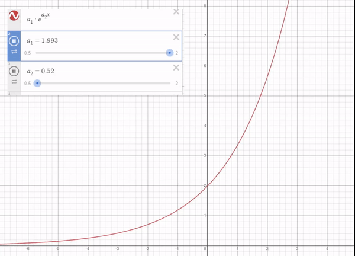
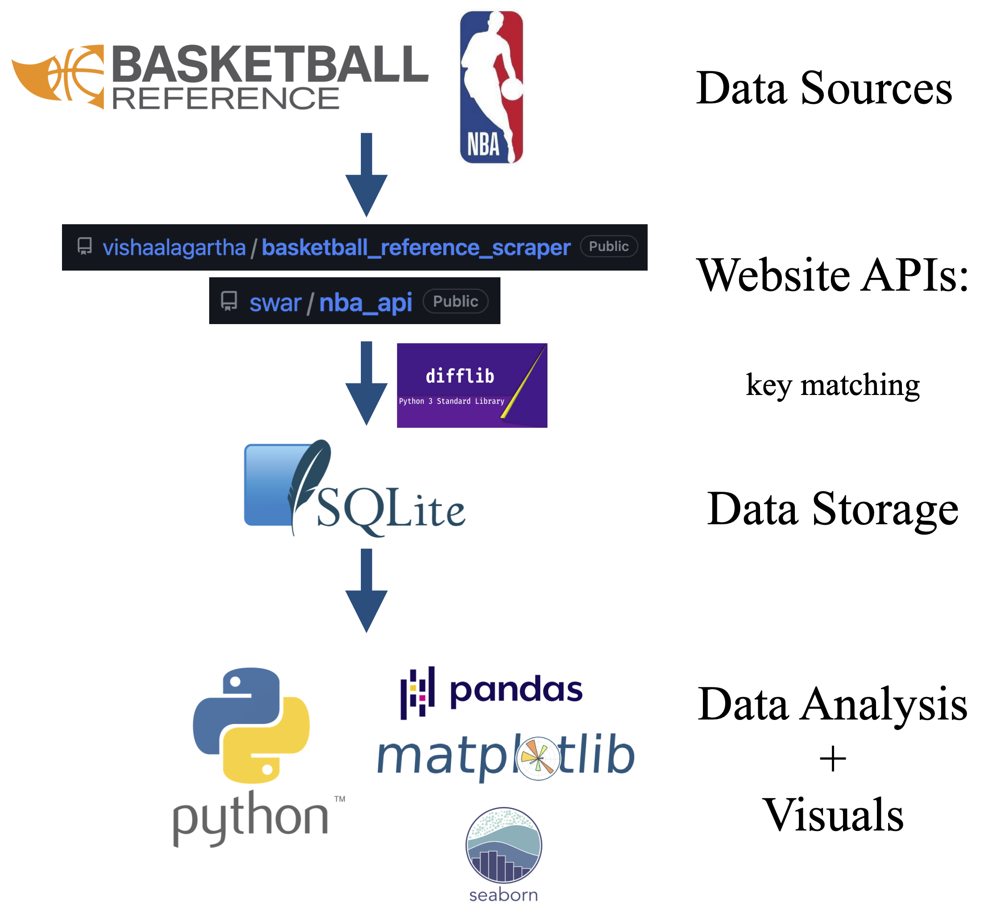
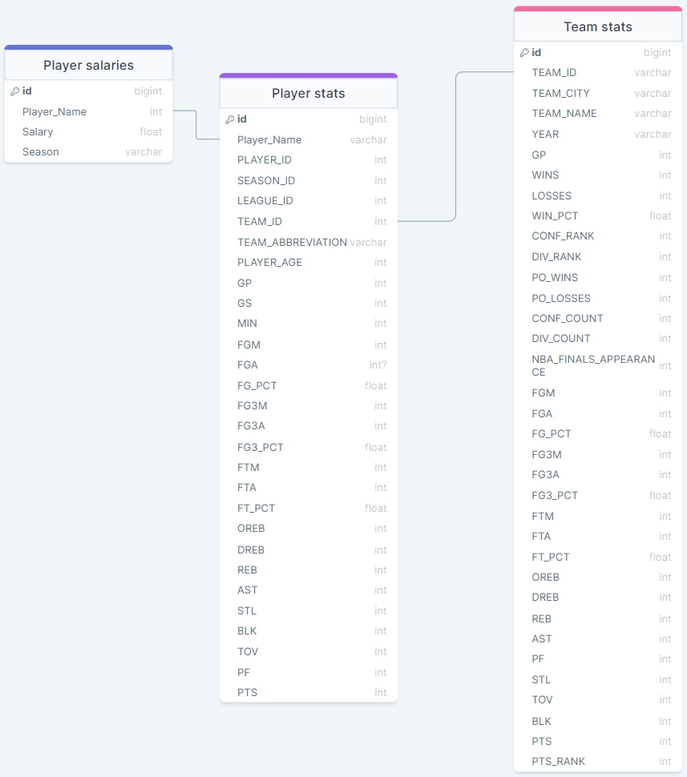

An Exploration of NBA Team Building Strategy Using Economic Theory \& Statistics
================================================================================

This repository provides an analysis of NBA team salaries and some SQL database design. For a full synopsis of all the algorithms, math and analysis used in this study, please see the 2 notebooks in this repo. If you would like a <strong>higher level summary of the findings</strong>, I wrote a Medium article in a sports journalism style summarizing the main findings (<a href="https://medium.com/@zgariepy123/an-exploration-of-nba-team-building-strategy-using-economic-theory-statistics-1d3f1827ed9a">Medium Article</a>)

Table of Contents
=================

<!--ts-->
   * [Background and Motivation](#background-and-motivation)
   * [Necessary Theory](#necessary-theory)
      * [Lorenz Curve](#lorenz-curve)
      * [Gini Coefficient](#gini-coefficient)
      * [Thiel Index](#thiel-index)
      * [Prinicipal Component Analysis](#principal-component-analysis)
   * [Tech Stack](#tech-stack)
   * [Usage](#usage)
   * [Code structure](#code-structure)
      * [File contents](#file-contents)
      * [Package dependencies](#package-dependencies)
   * [Potential Collaborators](#potential-collaborators)
<!--te-->

Background and Motivation
=========================

In the realm of NBA statistics and analytics, it seems like every stat has already been tracked and used to train a machine learning model. I've also seen countless Github projects generating some new iteration of FiveThirtyEight's RAPTOR or BBALL-Index's LEBRON stats that 'performs 8.8% better when projecting player performance if this niche condition is met'.

So in the hopes of doing something a little different from your typical 'advanced stats' project, I decided to see what we can do with available data instead of adding to the data lake bloat. After some online research, I realized very little work had been done on applying economic metrics to the NBA from a team building standpoint. Albeit Matt Frankenfeld and Nick Wells applied Lorenz curves to player stats to arrive at very similar conclusions to this study, I still felt like we were barely scraping the surface of team building insights from this new angle. What if we used these economic metrics commonly used to analyze a countries wealth inequality to instead analyze Win %?

Necessary Theory
================
Since this study uses a decent amount of economic metrics, it is necessary to briefly explain the metrics this study is based on.

Lorenz Curve
------------
The Lorenz curve is essentially a line visualizing the cumulative wealth of a population ordered from poorest to richest. This means we can fit exponential curves to them and based on model parameters, we can draw conclusions on team distributions.

Gini Coefficient
----------------
The Gini coefficient is essentially a ratio of a populations lorenz curve compared to a linear perfect equality curve. It ranges from 0-1 where the larger the coefficient, the more inequality in a population.

Thiel Index
-----------
The Thiel Index serves a similar purpose to the Gini coefficient but can be decomposed more easily. this study uses the Thiel_L index which is sensitive to inequality changes in the bottom end of salaries and the Thiel_T index which is sensitive the the top end salaries. 

Principal Component Analysis
----------------------------
This is a means to reduce the dimensionality of a feature space. For this project, I use it as a tool to visual the statistical profile of key NBA players on excellent teams. 

Tech Stack
==========

The graphic below walks through the data pipeline/tech stack used for this project. In short, I pooled data from BBall Reference and NBA.com, matched the data based on player names using a str matching library, designed a SQLite database composed of 3 tables (pictured below), and interfaced with the db using Python's built-in sqlite3 package.

     

The SQL database is composed of 3 tables containing data on player salaries, stats and team stats. The db linking can be found below.

     

Project Sections
================
0.5 - Database reliability  
--------------------------
The first section of the notebook highlights approximation and assumptions made to key match the various data sources. The average salary error per team was ~4.5% after eliminating common name mismatches. I have provided some examples below:

| Mismatch | BBall Ref | NBA.com |
|-----------------|-----------------|-----------------|
| Special Characters | Jokić | Jokic |
| Name Suffix | Jaren Jackson Jr. | Jaren Jackson |
| Suffix Annotation | Gary Trent Jr. | Gary Trent Jr |
| Abbreviations | JJ Barea | Jose Juan Barea Mora |

1 - Salary Progression
----------------------
This section studied the basic salary distribution over the years to provide a baseline for the datas mean and ranges we are dealing with.

2 - Economic theory applied to team salaries
--------------------------------------------
This section discusses the initial economic metric calculations used in the project. This includes some interesting trends I have yet to see quantified or even discussed online.

3 - Economic theory applied to contending teams
-----------------------------------------------
Interestingly enough, the Gini coefficient trends associated with championship teams correlate very strongly.

4 - Lorenz curve modeling
--------------------------
This section essentially provides mathematical proof that team salaries are trending towards exclusviely max/min contracts. The findings aren't that novel but I think the method I used to prove it is statistically significant and unique. 

5 - Principal component analysis of high Gini coefficient teams
---------------------------------------------------------------
To profile the optimal team compositions this study proposes, I wanted to look at historic teams that saw success with similar Gini coefficients. This was done by performing PCA on almost all the stats available from NBA.com and compare it to win percents. 

Code structure
==============
Package dependencies
--------------------

This repo contains the following files:

Salary_Analysis.ipynb: The main notebook walking through all the data analysis findings and methodologies used.

SQL_DB_Generation.ipynb: The supplementary notebook showing the SQL DB generation approach and string matching techniques used to create tables.

NBA_stats.db: SQLite database containing 3 tables of all the data used in this project. 

Analytics_Helpers.py: ~1500 lines of commented code contained in a analytics_helper class. This helper file provides all the functionality needed to easily fetch data and perform the economic metric calculation contained in the notebook.

Database_Operations.py: ~500 lines of code contained in a DB_operations class to interface with the APIs, create SQL tables, and match string names. 

Stats Folder: if you dont want to interface with the APIs/websites, I provide csv files of the data for conveniance.

Images Folder: supplementary images scattered throughout this repo.

All code is thoroughly commented but if you have any questions, please feel free to reach out to me!

Package dependencies
--------------------
- NumPy
- Pandas
- Matplotlib
- Seaborn
- NBA_api
- Py_ball
- Sklearn

Potential Collaborators
=======================
If you find this work interesting and want to build upon it, reach out! I believe there are still many different directions this type of research can go in.
